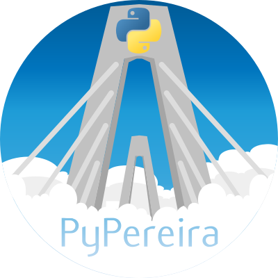

<div align="center">

# 🐍 🇨🇴 Sitio Web de la Comunidad de Python Pereira

<a href="https://github.com/pythonpereira">
  
</a>

[![Build Status][build-badge]][build]
[![MIT License][license-badge]][LICENSE]
[](https://www.python.org/)
[![PRs Welcome][prs-badge]][prs] 
[](https://github.com/pythonpereira/sitio-web/issues)
[](https://twitter.com/pythonpereiran)

Este es el repositorio del sitio web de la comunidad servido por
[Github](https://pythonpereiragithub.io/sitio-web-desarrollo/), y
construido utilizando [lektor](https://www.getlektor.com). Se utilizó la plantilla [txt](https://html5up.net/txt) como base.

</div>

# 🔀 Flujo de trabajo

Hay 2 ramas de git, `develop` y `production`.

## ⤴️ Develop

Es la rama por defecto y se despliega a través de gh-pages con Lektor a
https://pythonpereira.github.io/sitio-web-desarrollo/
(en http://develop.pypereira.co)

## ⤴️ Production

Después de que se han ejecutado las pruebas de calidad (QA), los cambios
realizados en la rama `develop` se unen con la rama `production` y son
desplegados a través de gh-pages con Lektor a 
https://pythonpereira/sitio-web-produccion/
(pronto en http://pypereira.co)

# 🛠 Desarrollo local

## ✅ (Opcional) Entorno Virtual

### Instalación

* Instalar [virtualenv](https://virtualenv.pypa.io/en/stable/installation/)

* ⚠️️ Requiere previa instalación de Python ⚠️

### Crear entorno virtual

```
$ virtualenv <nombre_entorno>
```

### Activar entorno virtual

#### Windows

```
$ <nombre_entorno>\Scripts\activate
```

#### Linux

```
$ source <nombre_entorno>/bin/activate
```

## ✅ Instala Lektor

### Usando pip:
```
$ pip install -U Lektor unidecode
```

### Usando conda:

```
$ conda install lektor unidecode -c conda-forge
```

## ✅ Instala (reinstala) los `plugins` locales

```
$ lektor plugins reinstall
```

## ✅ Corre el servidor local

```
$ lektor server
```

## ⁉️ Problemas comunes

* 🔴 Si en algun momento luego de instalar python3 y crear tu virtualenv. haces `lektor server` y ves este error:

```
RuntimeError: Click will abort further execution because Python 3 was configured to use ASCIas encoding for the environment.  Consult http://click.pocoo.org/python3/for mitigation steps.
```
Haz esto adentro de tu virtualenv:
```
export LC_ALL=en_us.UTF-8
export LANG=en_us.UTF-8
```

* 🔴 Si ves `jinja2.exceptions.UndefinedError: 'estimate_reading_time' is undefined` significa que necesitas instalar o reinstalar los `plugins` de lektor. Puedes hacer esto ejecutando

```
$ lektor plugins reinstall
```

# 🚀 Despliegue

Gracias a _Lektor Bot_ (Plugin de lektor conectado a Github), podemos desplegar nuestra web estática en diferentes repositorios (en la rama seleccionada en configuración - `gh-pages` en nuestro caso).

La configuración de dichos repositorios se encuentra en `python-colombia.lektorproject`

## ✔️ Desarrollo

```
$ lektor deploy
```

Se desplegará el contenido de la rama `develop` en `develop.pypereira.co`

## ✔️✔️ Producción

```
$ lektor deploy production
```

Se desplegará el contenido de la rama `production` en `pypereira.co`

___
<div align="center">

💪 Colaboradores

|[<br /><sub><b>Alejandro E. Rendon</b></sub>](https://github.com/aerendon)|
| :---: |

</div>

[build-badge]: https://img.shields.io/travis/pythonpereira/sitio-web.svg?style=flat-square
[build]: https://travis-ci.org/pythonpereira/sitio-web
[license-badge]: https://img.shields.io/npm/l/all-contributors.svg?style=flat-square
[license]: https://github.com/kentcdodds/all-contributors/blob/master/LICENSE
[prs-badge]: https://img.shields.io/badge/Issues-welcome-brightgreen.svg?style=flat-square
[prs]: https://github.com/pythonpereira/sitio-web/issues/new

> Estructura basada en [Sitio Web Python Colombia](https://github.com/ColombiaPython/sitio-web)